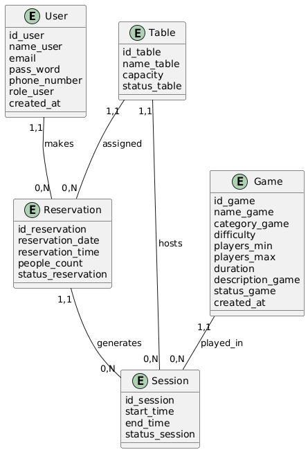
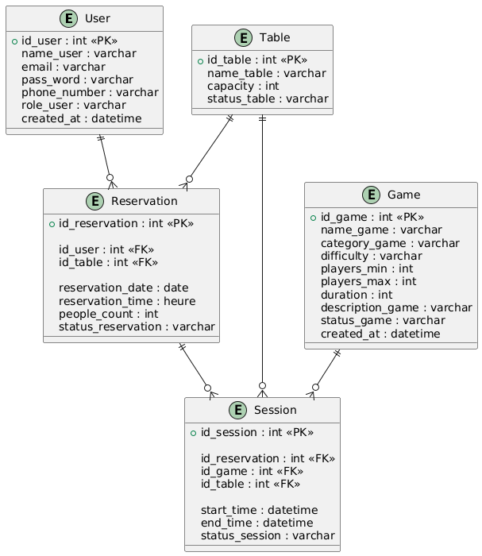

# 🎲 Aji L3bo Café

A web application for managing a board game café — players can browse games, book tables, and track reservations. Admins manage games, reservations, and live gaming sessions.

---

## 📋 Table of Contents

- [Features](#features)
- [Tech Stack](#tech-stack)
- [Project Structure](#project-structure)
- [Database Design](#database-design)
- [Installation](#installation)
- [Configuration](#configuration)
- [Routes](#routes)

---

## ✨ Features

### Player
- Register & login
- Browse game catalogue (filter by category)
- Check table availability by date & time
- Book a table (with optional game selection)
- View and track personal reservations

### Admin
- Dashboard with live stats (total games, today's reservations, active sessions, occupied tables)
- Manage games (create, edit, delete)
- Manage all reservations (confirm / cancel)
- Start, monitor, and end live gaming sessions
- View full session history

---

## 🛠 Tech Stack

| Layer      | Technology                          |
|------------|-------------------------------------|
| Language   | PHP 8.2                             |
| Server     | Apache 2.4 (XAMPP)                  |
| Database   | MySQL (via PDO)                     |
| Frontend   | HTML5, CSS3 (custom design system)  |
| Fonts      | Orbitron + Space Grotesk (Google)   |
| Autoload   | Composer (PSR-4)                    |
| Routing    | Custom `Core\Router`                |

---

## 📁 Project Structure

```
Cafe-Aji-L3bo/
├── app/
│   ├── Controller/         # AuthController, DashboardController, GameController,
│   │                       #   ReservationController, SessionController
│   ├── Model/              # User, Game, Table, Reservation, Session
│   └── View/
│       ├── auth/           # login.php, register.php
│       ├── dashboard/      # admin.php, player.php
│       ├── games/          # index, show, create, edit
│       ├── reservation/    # index, create, availability, myreservations
│       ├── Session/        # dashboard, create, history
│       ├── layout/         # header.php, footer.php
│       └── error/          # 404.php
├── config/
│   └── database.php        # DB connection config
├── core/
│   ├── Database.php        # PDO singleton
│   └── Router.php          # Custom router
├── database/
│   └── schema.sql          # Full DB schema
├── public/
│   ├── index.php           # Front controller (entry point)
│   └── css/style.css       # Design system
├── routes/
│   └── web.php             # All application routes
├── images/                 # DB diagrams
├── .htaccess               # Rewrite rules
└── composer.json
```

---

## 🗄 Database Design

### Conceptual Model (MCD)



### Logical Model (MLD)



### Entities

| Table          | Key Fields                                                                              |
|----------------|-----------------------------------------------------------------------------------------|
| `users`        | id_user, name_user, email, pass_word, phone_number, role_user, created_at              |
| `tables`       | id_table, name_table, capacity, status_table                                           |
| `games`        | id_game, name_game, category_game, difficulty, players_min/max, duration, status_game  |
| `reservations` | id_reservation, id_user (FK), id_table (FK), reservation_date, reservation_time, people_count, status_reservation |
| `sessions`     | id_session, id_reservation (FK), id_game (FK), id_table (FK), start_time, end_time, status_session |

---

## ⚙️ Installation

### Prerequisites
- XAMPP (PHP 8.2, Apache, MySQL)
- Composer

### Steps

```bash
# 1. Clone the repo inside htdocs
cd C:/xampp/htdocs
git clone https://github.com/githubname/namerepo.git

# 2. Install dependencies
cd Cafe-Aji-L3bo
composer install

# 3. Import the database
#    Open phpMyAdmin or run:
mysql -u root -p < database/schema.sql

# 4. Visit the app
http://localhost/autoformationphp/Cafe-Aji-L3bo/
```

---

## 🔧 Configuration

Edit `config/database.php` to match your environment:

```php
return [
    'host'   => 'localhost',
    'port'   => 3306,        // default MySQL port is 3306; XAMPP sometimes uses 3307
    'dbname' => 'aji_l3bo_cafe',
    'user'   => 'root',
    'pass'   => ''
];
```

---

## 🛤 Routes

| Method | URL                           | Description                           |
|--------|-------------------------------|---------------------------------------|
| GET    | `/`                           | Redirect to login                     |
| GET    | `/login`                      | Login page                            |
| POST   | `/login`                      | Handle login                          |
| GET    | `/register`                   | Register page                         |
| POST   | `/register`                   | Handle registration                   |
| GET    | `/logout`                     | Logout                                |
| GET    | `/admin/dashboard`            | Admin dashboard                       |
| GET    | `/player/dashboard`           | Player dashboard                      |
| GET    | `/games`                      | Game catalogue (with category filter) |
| GET    | `/games/create`               | Create game form (admin)              |
| POST   | `/games`                      | Store new game                        |
| GET    | `/games/{id}`                 | Game detail                           |
| GET    | `/games/{id}/edit`            | Edit game form (admin)                |
| POST   | `/games/{id}/update`          | Update game                           |
| POST   | `/games/{id}/delete`          | Delete game                           |
| GET    | `/reservations`               | All reservations (admin)              |
| GET    | `/reservations/create`        | Book a table form                     |
| POST   | `/reservations`               | Store reservation                     |
| GET    | `/reservations/my`            | My reservations (player)              |
| GET    | `/reservations/availability`  | Check table availability              |
| POST   | `/reservations/{id}/status`   | Confirm / cancel reservation          |
| GET    | `/sessions`                   | Active sessions dashboard             |
| GET    | `/sessions/create`            | Start session form                    |
| POST   | `/sessions`                   | Store session                         |
| POST   | `/sessions/{id}/end`          | End a session                         |
| GET    | `/sessions/history`           | Session history                       |
| GET    | `/api/available-tables`       | AJAX — available tables               |
| GET    | `/api/available-games`        | AJAX — available games                |